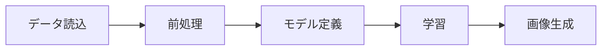
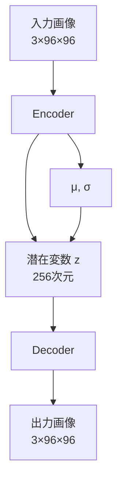
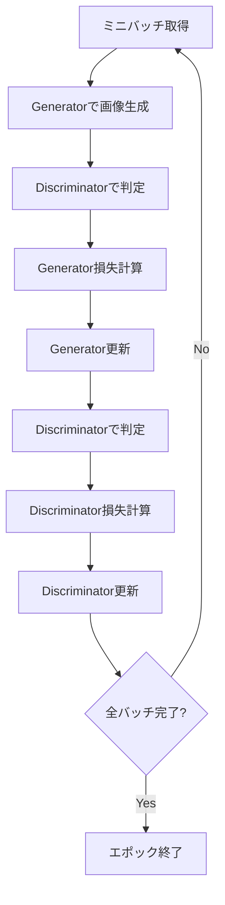
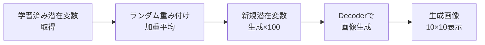

# このフォルダのプログラムについて

このフォルダのmainプログラム(main.ipynb)は、GANやVAEやResNetの勉強を兼ねて、Hugging Faceにアップロードされているデータを画像生成の題材として用いて、GANやVAEやResNetの実装およびFine Tuningを試してみたものになります。<br>


# VAE-GAN による画像生成プログラム

アニメ顔画像データセットを用いたVAE(Variational Autoencoder)とGAN(Generative Adversarial Network)のハイブリッドモデルによる画像生成

## プログラム概要



**主要処理:**
- HuggingFaceからアニメ顔画像データセット取得
- VAE-GANモデルの構築と学習
- 潜在変数から新規画像生成

---

## データ準備

**データセット読込**

```python
# HuggingFaceからデータセット取得
hugging_face_dataset_dict = datasets.load_dataset(
    "DrishtiSharma/Anime-Face-Dataset"
)
ds = hugging_face_dataset_dict["train"]
```

**フィルタリング処理:**
1. 3階テンソル(RGB画像)のみ抽出
2. 3チャンネル画像のみ抽出(αチャンネル除外)

---

## データ拡張

**画像変換処理**

```python
image_transform_method = torchvision.transforms.Compose([
    torchvision.transforms.Resize(size=(96, 96)),
    torchvision.transforms.RandomHorizontalFlip(p=0.5),
    torchvision.transforms.RandomRotation(degrees=(-10, 10))
])
```

**処理内容**
- 画像サイズを96×96にリサイズ
- 50%の確率で水平反転
- -10度から10度のランダム回転
- 正規化(0-255 → 0-1)とテンソル化

---

## モデルアーキテクチャ(1/3): Generator



**Generator = VAE構造**
- Encoder: 画像 → 潜在変数(z)
- Decoder: 潜在変数(z) → 画像

---

## モデルアーキテクチャ(2/3): Encoder

**Encoder構造**

| Layer | Input Channels | Output Channels | Resolution |
|-------|----------------|-----------------|------------|
| Input | 3 | - | 96×96 |
| Conv1 | 3 | 32 | 48×48 |
| Conv2 | 32 | 64 | 24×24 |
| Conv3 | 64 | 128 | 12×12 |
| Conv4 | 128 | 256 | 6×6 |
| Conv5 | 256 | 512 | 3×3 |
| FC(μ) | 4608 | 256 | - |
| FC(σ) | 4608 | 256 | - |

**再パラメータ化トリック:** z = μ + exp(σ/2) × ε

---

## モデルアーキテクチャ(3/3): Decoder & Discriminator

**Decoder構造**
- 潜在変数(256次元) → 全結合層 → 4608次元
- ConvTranspose2dで段階的にアップサンプリング
- 512ch(3×3) → 256ch(6×6) → 128ch(12×12) → 64ch(24×24) → 32ch(48×48) → 3ch(96×96)

**Discriminator構造**
- ResNet50ベースのアーキテクチャ
- Patch GAN形式(3×3の出力)
- 入力: 3×96×96 → 出力: 1×3×3

---

## 損失関数

**Generator損失(4項の合計)**

```python
loss_G = loss_G1 + (coefficient * loss_G2) + loss_G3 + loss_G4
```

1. loss_G1: BCE(D(G(x)), 1) - GAN損失
2. loss_G2: MAE(G(x), x) × 100 - 再構成損失
3. loss_G3: BCE(G(x), x) - VAE再構成損失
4. loss_G4: KLダイバージェンス - VAE正則化項

**Discriminator損失**

```python
loss_D = loss_D1 + loss_D2
```

1. loss_D1: BCE(D(x), 1) - 真画像を真と判定
2. loss_D2: BCE(D(G(x)), 0) - 生成画像を偽と判定

---

## 学習プロセス



---

## 画像生成プロセス



**生成方法:**
1. 最終エポックの潜在変数(3サンプル)を取得
2. ランダムな重み(総和=1.0)で加重平均
3. 100個の新規潜在変数を生成
4. Decoderで画像に変換

---

## 技術的特徴

**使用技術**

- VAE: 潜在空間での画像表現学習
- GAN: 高品質な画像生成
- ResNet50: Discriminatorの深層構造
- Patch GAN: 局所的な真偽判定

**データ拡張**

- リサイズ、反転、回転による汎化性能向上

**正規化手法**

- BatchNormalization
- LeakyReLU活性化関数
