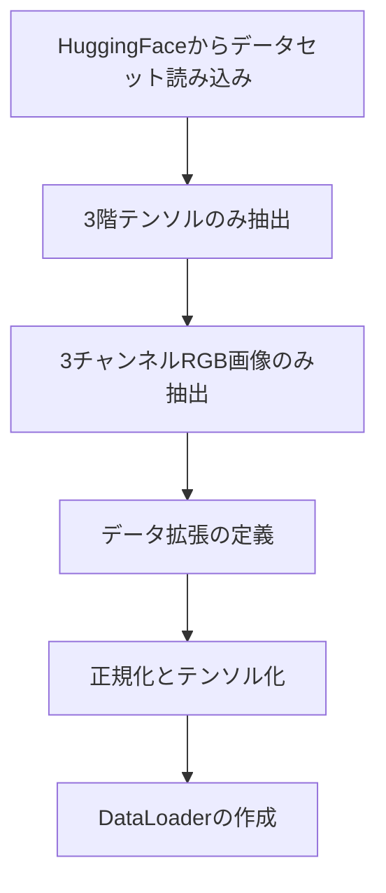
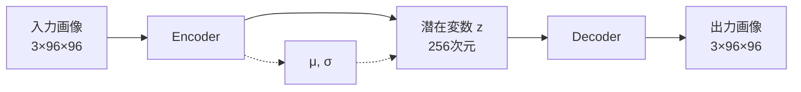
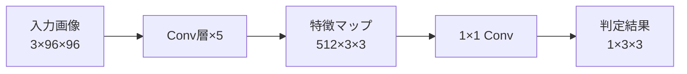
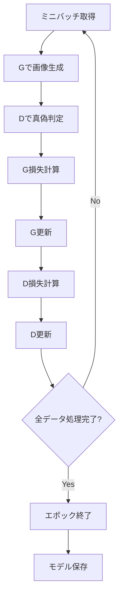
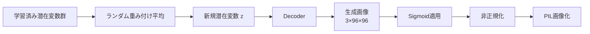

# このフォルダのプログラムについて

このフォルダのmainプログラム(main.ipynb)は、GANやVAEの勉強を兼ねて、Hugging Faceにアップロードされているデータを画像生成の題材として用いて、GANやVAEの実装およびFine Tuningを試してみたものになります。 

# VAE-GANによるアニメ顔画像生成

## プログラムの目的

**VAE (Variational Autoencoder) と GAN (Generative Adversarial Network) を組み合わせたモデルによるアニメ顔画像の生成**

- HuggingFaceのアニメ顔データセットを使用
- VAEとGANのハイブリッドアーキテクチャで学習
- 潜在変数から新規画像を生成

---

## データ準備フロー

**データ拡張内容:**
- リサイズ: 96×96
- ランダム水平反転 (p=0.5)
- ランダム回転 (-10°～10°)

---

## モデルアーキテクチャ (1/3): Generator

**Encoder:**
- 5層の畳み込み層 (Conv2d + BatchNorm + LeakyReLU)
- チャンネル数: 3→32→64→128→256→512
- 解像度: 96×96 → 3×3
- 全結合層でμとσを出力し、再パラメータ化トリックでzを生成

---

## モデルアーキテクチャ (2/3): Decoder

**Decoder:**
- 全結合層で潜在変数を展開
- 5層の転置畳み込み層 (ConvTranspose2d + BatchNorm + LeakyReLU)
- チャンネル数: 512→256→128→64→32→3
- 解像度: 3×3 → 96×96
- 最終層で3チャンネルの画像を出力

---

## モデルアーキテクチャ (3/3): Discriminator

**Discriminator:**
- 5層の畳み込み層 (Conv2d + BatchNorm + LeakyReLU)
- チャンネル数: 3→32→64→128→256→512
- 最終層で真偽判定を出力

---

## 損失関数の構成

**Generator (G) の損失:**
- `loss_G1`: GAN損失 (DがG出力を本物と判定するように)
- `loss_G2`: L1損失 (入力画像との差) × 係数100
- `loss_G3`: VAE再構成損失 (BCE)
- `loss_G4`: VAE正則化項 (KLダイバージェンス)

**Discriminator (D) の損失:**
- `loss_D1`: 本物画像を本物と判定
- `loss_D2`: G生成画像を偽物と判定

---

## 学習プロセス

---

## 画像生成プロセス

**生成手順:**
1. 最新エポックの潜在変数を取得
2. ランダムな重みで100個の潜在変数を生成
3. Decoderで画像生成
4. 10×10グリッドで可視化
