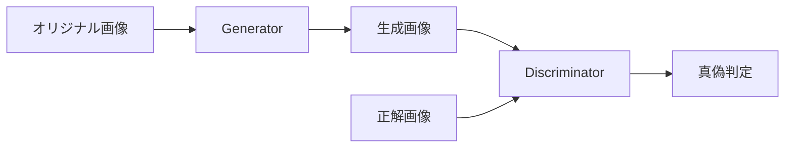
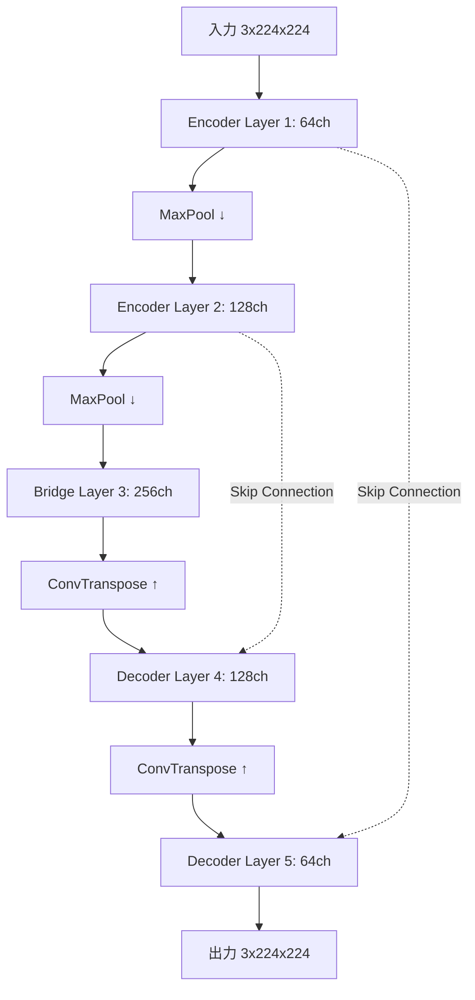
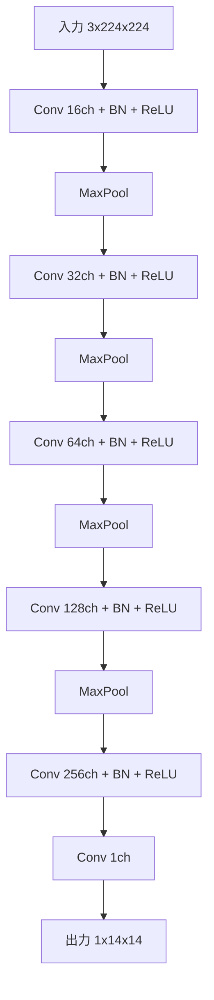
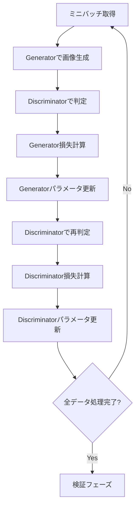

# このフォルダのプログラムについて

このフォルダのmainプログラム(main.ipynb)は、pix2pixの勉強を兼ねて、Hugging Faceにアップロードされているセマンティックセグメンテーション用のデータをimage-to-imageの題材の代わりとして用いて、pix2pixの実装やFine Tuningを試してみたものになります。<br>


# Pix2Pix GANによる画像セグメンテーション

Pascal VOC 2012データセットを用いた画像変換モデルの実装

---

## プログラム概要

- **目的**: オリジナル画像からセグメンテーション画像を生成
- **手法**: Pix2Pix (条件付きGAN)
- **データセット**: Pascal VOC 2012 (valデータ)
- **フレームワーク**: PyTorch



---

## データ準備フロー

1. Pascal VOC 2012データセットのダウンロード
2. オリジナル画像とセグメンテーション画像のペアを作成
3. RGB形式への変換
4. 80%をtrain、20%をvalidationに分割

**前処理**:
- 画像サイズを224×224にリサイズ
- 正規化 (0-255 → 0-1)
- テンソル化

---

## モデルアーキテクチャ: Generator (U-Net)



**特徴**: エンコーダとデコーダ間のスキップコネクション

---

## Generator詳細構造

**エンコーダ部分**
- Layer 1: Conv2d(3→64) + BatchNorm + ReLU
- Layer 2: Conv2d(64→128) + BatchNorm + ReLU
- Bridge: Conv2d(128→256) + BatchNorm + ReLU

**デコーダ部分**
- Layer 4: ConvTranspose2d(256→128) + スキップ接続 + Conv2d
- Layer 5: ConvTranspose2d(128→64) + スキップ接続 + Conv2d
- 出力: Conv2d(64→3)

各層でMaxPool2dによるダウンサンプリング、ConvTranspose2dによるアップサンプリング

---

## モデルアーキテクチャ: Discriminator



**役割**: 入力画像が本物か生成画像かを判定

---

## 損失関数

**Generator損失**
```python
loss_G = loss_BCE(D(G(x)), true_label) + 100 * loss_MAE(G(x), y)
```
- BCE Loss: Discriminatorを騙すための損失
- MAE Loss: 正解画像との差異を最小化 (係数100)

**Discriminator損失**
```python
loss_D = loss_BCE(D(G(x)), false_label) + loss_BCE(D(y), true_label)
```
- 生成画像を偽物と判定
- 正解画像を本物と判定

---

## 学習プロセス



---

## まとめ

**実装内容**:
- Pix2Pix GANによる画像変換タスク
- U-Net構造のGeneratorとCNN構造のDiscriminator
- Pascal VOC 2012データセットでの学習
