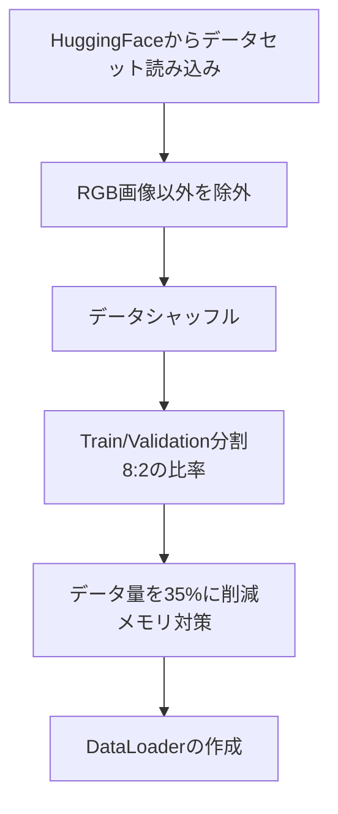
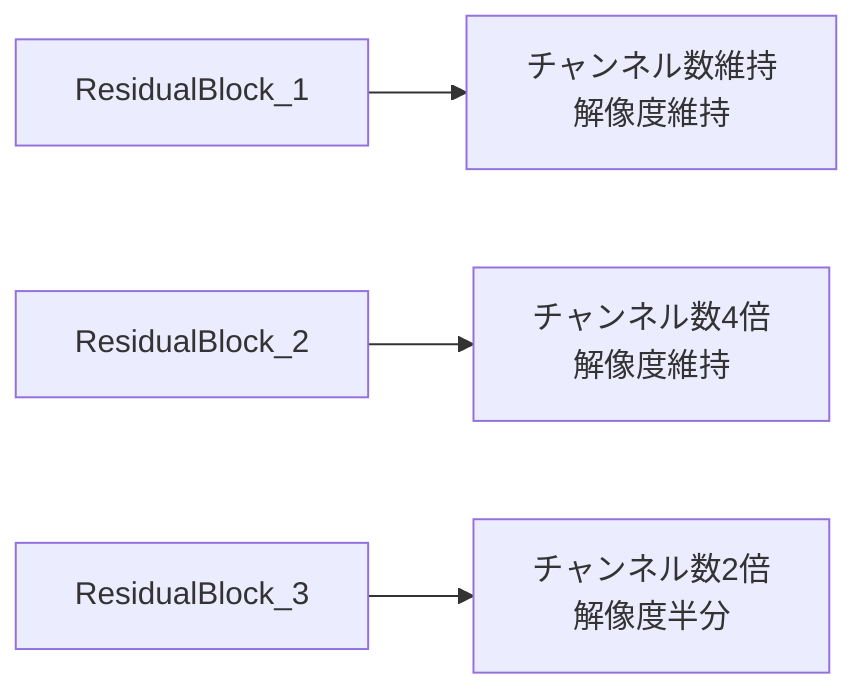

# このフォルダのプログラムについて

このフォルダのmainプログラム(main.ipynb)は、ResNetの勉強を兼ねて、Hugging Faceにアップロードされている画像分類用のデータを題材にして、ResNetの実装やFine Tuningを試してみたものになります。 

# ResNet50による犬猫画像分類

PyTorchを用いたResNet50の実装と学習

## プログラム概要

- 目的: 犬と猫の画像を分類する二値分類モデルの構築
- 使用モデル: ResNet50（スクラッチ実装）
- データセット: HuggingFace `cats_vs_dogs`
- フレームワーク: PyTorch

---

## データ準備フロー

---

## データ前処理

**データ拡張(Data Augmentation)**
- リサイズ: 224×224ピクセルに統一
- ランダム左右反転: 確率50%で適用

**正規化とテンソル化**
1. PIL画像 → NumPy配列に変換
2. 形状変換: (H, W, C) → (C, H, W)
3. 正規化: ピクセル値を255で除算 (0-1の範囲)
4. PyTorchテンソルに変換

---

## ResNet50アーキテクチャ

**3種類のResidualブロック**

---

## ResNet50ネットワーク構成

| レイヤー | 処理内容 | 出力チャンネル | 出力サイズ |
|---------|---------|--------------|-----------|
| 入力 | - | 3 | 224×224 |
| Layer 1 | Conv+BN+ReLU | 64 | 112×112 |
| Layer 2 | MaxPool+ResBlocks×3 | 256 | 56×56 |
| Layer 3 | ResBlocks×4 | 512 | 28×28 |
| Layer 4 | ResBlocks×6 | 1024 | 14×14 |
| Layer 5 | ResBlocks×3 | 2048 | 7×7 |
| Layer 6 | AdaptiveAvgPool | 2048 | 1×1 |
| Layer 7 | Linear | 2 | - |

---

## まとめ

**実装内容**
- ResNet50をPyTorchでスクラッチ実装
- 犬猫画像の二値分類タスクを実行
- データ拡張・正規化による前処理
- 学習・検証の自動化とチェックポイント保存
- 結果の可視化と評価
