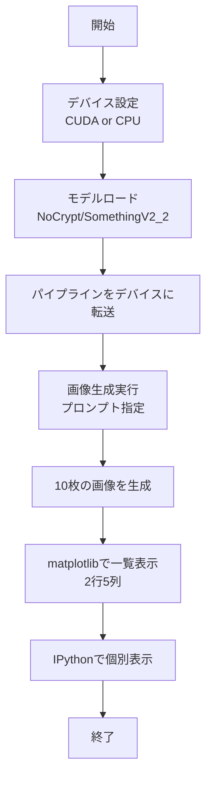

# このフォルダのプログラムについて

このフォルダのmainプログラム(main.ipynb)は、Stable Diffusion 1.5のFine TunedモデルのSomethingV2_2を用いて、プロンプトにて画像生成を試してみたものになります。 

# 画像生成AIプログラムの概要

diffusersライブラリーでstable diffusionを使用した画像生成プログラム

---

## 処理フロー

---

## モデル設定

- **デバイス**: CUDA利用可能ならGPU、なければCPU
- **モデル**: `NoCrypt/SomethingV2_2` (Hugging Faceからロード)
- **データ型**: `torch.float16` (メモリ効率化)

---

## 画像生成パラメータ

| パラメータ | 値 | 説明 |
|----------|-----|------|
| `height` / `width` | 512 | 画像サイズ |
| `num_inference_steps` | 20 | 推論ステップ数 |
| `guidance_scale` | 7.0 | プロンプト遵守度 |
| `num_images_per_prompt` | 10 | 生成画像数 |
| `generator` | seed=1234 | 乱数シード(再現性) |
| `output_type` | "pil" | 出力形式 |
