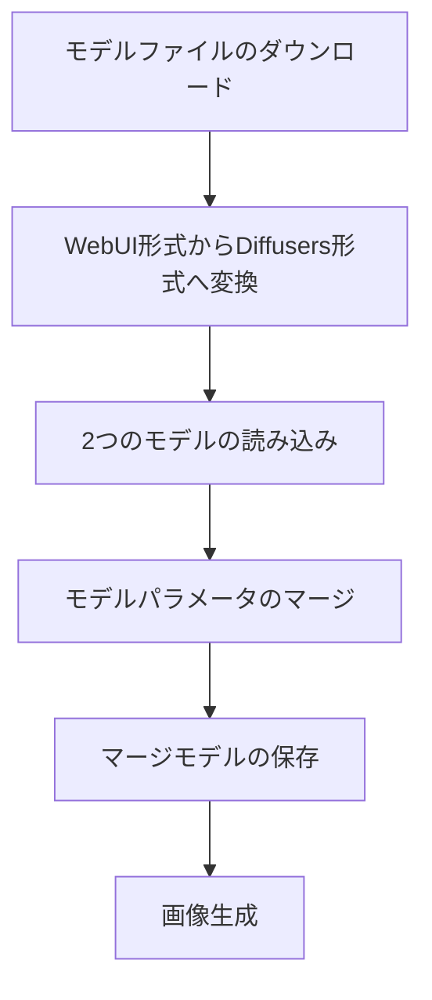
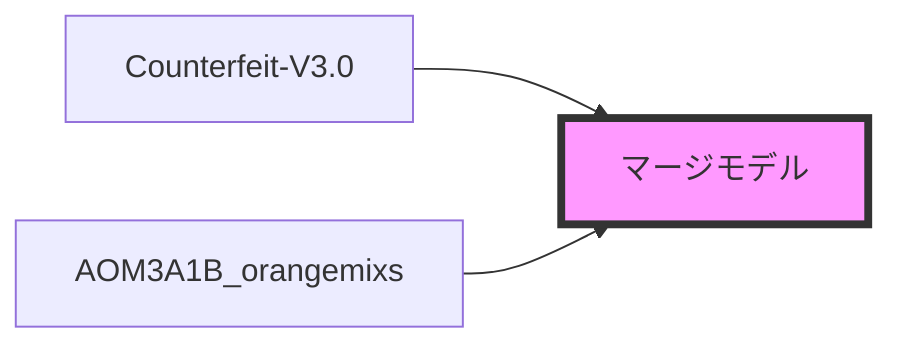
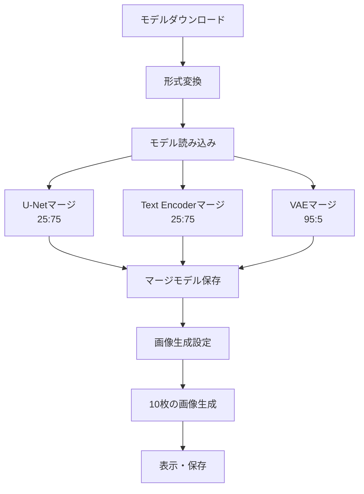

# このフォルダのプログラムについて

このフォルダのmainプログラム(main.ipynb)は、Stable Diffusion 1.5のFine TunedモデルのCounterfeit-V3.0とOrangeMixsをマージして、そのマージモデルを用いて、プロンプトにて画像生成を試してみたものになります。<br>


# Stable Diffusionモデルのマージ処理

2つの画像生成AIモデルを重み付けマージして新しいモデルを作成し、画像生成を行うプログラム

---

## 処理フロー全体像



---

## モデルファイルの準備

**ダウンロード対象**
- Counterfeit-V3.0 (safetensorsファイル)
- AOM3A1B_orangemixs (safetensorsファイル)
- orangemix.vae (ptファイル)

**形式変換**
WebUI形式 → Diffusers形式に変換
- `convert_original_stable_diffusion_to_diffusers.py`を使用
- `convert_vae_pt_to_diffusers.py`を使用

---

## マージ処理の構成要素

Stable Diffusionモデルの3つの主要コンポーネントをマージ:



1. **U-Net** (ノイズ除去ネットワーク)
2. **Text Encoder** (テキストエンコーダー)
3. **VAE** (画像エンコーダー/デコーダー)

---

## U-Netのマージ

**パラメータ取得**
```python
counterfeit_model_unet_param = dict(merge_model_pipe.unet.named_parameters())
orangemix_model_unet_param = dict(pipe_2.unet.named_parameters())
```

**重み付けマージ (25:75)**
```python
for key, value in merge_model_pipe.unet.named_parameters():
    value.data = 0.25 * counterfeit_model_unet_param[key] + \
                 0.75 * orangemix_model_unet_param[key]
```

**Counterfeit 25% + OrangeMix 75%**

---

## Text Encoderのマージ

**パラメータ取得**
```python
counterfeit_model_textencoder_param = dict(merge_model_pipe.text_encoder.named_parameters())
orangemix_model_textencoder_param = dict(pipe_2.text_encoder.named_parameters())
```

**重み付けマージ (25:75)**
```python
for key, value in merge_model_pipe.text_encoder.named_parameters():
    value.data = 0.25 * counterfeit_model_textencoder_param[key] + \
                 0.75 * orangemix_model_textencoder_param[key]
```

**Counterfeit 25% + OrangeMix 75%**

---

## VAEのマージ

**パラメータ取得**
```python
counterfeit_model_vae_param = dict(merge_model_pipe.vae.named_parameters())
orangemix_model_vae_param = dict(pipe_2.vae.named_parameters())
```

**重み付けマージ (95:5)**
```python
for key, value in merge_model_pipe.vae.named_parameters():
    value.data = 0.95 * counterfeit_model_vae_param[key] + \
                 0.05 * orangemix_model_vae_param[key]
```

**Counterfeit 95% + OrangeMix 5%**

---

## 画像生成処理

**生成パラメータ**
- プロンプト: "masterpiece, 1girl, brown eyes, black long hair, smile..."
- 画像サイズ: 512×512
- 推論ステップ数: 20
- ガイダンススケール: 7.0
- 生成枚数: 10枚
- シード値: 1234 (固定)

---

## 処理の全体構成


