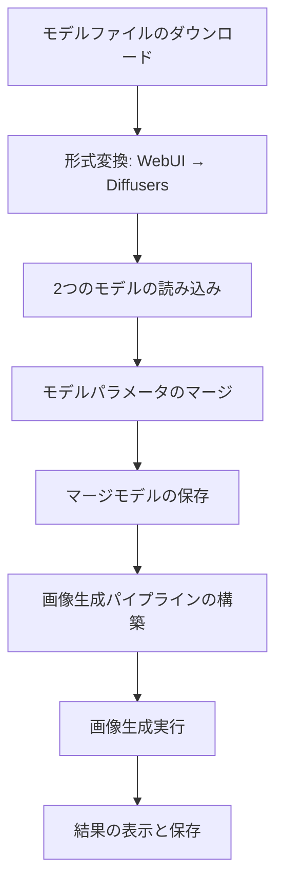
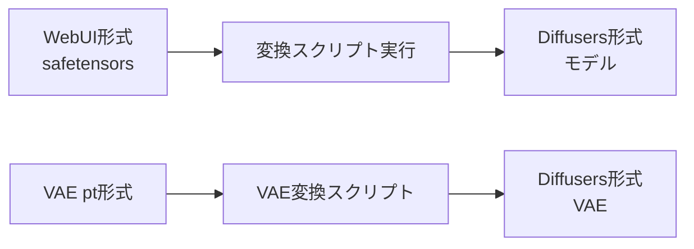
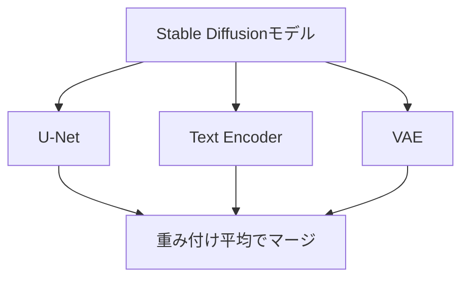

# このフォルダのプログラムについて

このフォルダのmainプログラム(main.ipynb)は、Stable Diffusion 1.5のFine TunedモデルのCounterfeit-V3.0とOrangeMixsをマージして、そのマージモデルを用いつつ、トークン数と強調の制限を解除してプロンプトにて画像生成を試してみたものになります。<br>


# Stable Diffusionモデルのマージと画像生成

## 処理の全体フロー



---

## モデルファイルのダウンロード

**ダウンロード対象**
- Counterfeit-V3.0 (safetensorsファイル)
  - Hugging Faceからwgetでダウンロード
  
- OrangeMixs (AOM3A1B) (safetensorsファイル)
  - Hugging Faceからwgetでダウンロード
  
- OrangeMixs VAE (ptファイル)
  - VAE(Variational Autoencoder)ファイル

保存先: `./webUI_model/`

---

## モデル形式の変換

**WebUI形式 → Diffusers形式**



**変換パラメータ**
- 画像サイズ: 512x512
- 予測タイプ: epsilon
- デバイス: CPU

---

## モデルの読み込み

**2つのモデルをStableDiffusionPipelineとして読み込み**

```python
# Counterfeit-V3.0の読み込み
merge_model_pipe = StableDiffusionPipeline.from_pretrained(
    MODEL_counterfeit, torch_dtype=torch.float16)

# AOM3A1B_orangemixsの読み込み
pipe_2 = StableDiffusionPipeline.from_pretrained(
    MODEL_orangemix, torch_dtype=torch.float16)
```

---

## モデルパラメータのマージ

**マージ対象コンポーネント**



---

## U-Netのマージ

**マージ比率: Counterfeit 25% : OrangeMix 75%**

```python
for key, value in merge_model_pipe.unet.named_parameters():
    value.data = 0.25 * counterfeit_unet[key] + 
                 0.75 * orangemix_unet[key]
```

U-Netは画像のノイズ除去を担当する主要コンポーネント

---

## Text Encoderのマージ

**マージ比率: Counterfeit 25% : OrangeMix 75%**

```python
for key, value in merge_model_pipe.text_encoder.named_parameters():
    value.data = 0.25 * counterfeit_textencoder[key] + 
                 0.75 * orangemix_textencoder[key]
```

Text Encoderはプロンプトテキストを埋め込みベクトルに変換

---

## VAEのマージ

**マージ比率: Counterfeit 95% : OrangeMix 5%**

```python
for key, value in merge_model_pipe.vae.named_parameters():
    value.data = 0.95 * counterfeit_vae[key] + 
                 0.05 * orangemix_vae[key]
```

VAEは潜在空間と画像空間の変換を担当

---

## マージ比率のまとめ

| コンポーネント | Counterfeit-V3.0 | OrangeMix |
|:---:|:---:|:---:|
| U-Net | 25% | 75% |
| Text Encoder | 25% | 75% |
| VAE | 95% | 5% |

- U-NetとText EncoderはOrangeMix寄り
- VAEはCounterfeit寄り

---

## スケジューラの設定と保存

**UniPCMultistepSchedulerの適用**

```python
merge_model_pipe.scheduler = 
    UniPCMultistepScheduler.from_config(
        merge_model_pipe.scheduler.config)
```

---

## 画像生成パイプラインの構築

**カスタムパイプラインの使用**

```python
pipe = DiffusionPipeline.from_pretrained(
    pretrained_model_name_or_path=MODEL,
    custom_pipeline="AlanB/lpw_stable_diffusion_update",
    torch_dtype=torch.float16)
```

**特徴**
- Long Prompt Weighting (LPW)対応
- トークン数制限の解除
- 強調表現の制限解除

---

## 画像生成の実行

**生成パラメータ**

| パラメータ | 値 |
|:---|:---|
| 画像サイズ | 512 x 512 |
| 推論ステップ数 | 20 |
| ガイダンススケール | 7.0 |
| 生成枚数 | 10枚 |
| シード値 | 1234 (固定) |
| max_embeddings_multiples | 5 |

---

## 処理のまとめ

1. **モデル準備**: 2つのStable Diffusionモデルをダウンロード・変換
2. **モデルマージ**: U-Net、Text Encoder、VAEを重み付け平均でマージ
3. **パイプライン構築**: LPW対応のカスタムパイプラインを使用
4. **画像生成**: 指定プロンプトで10枚の画像を生成
5. **結果保存**: タイムスタンプ付きJPEGファイルとして保存
