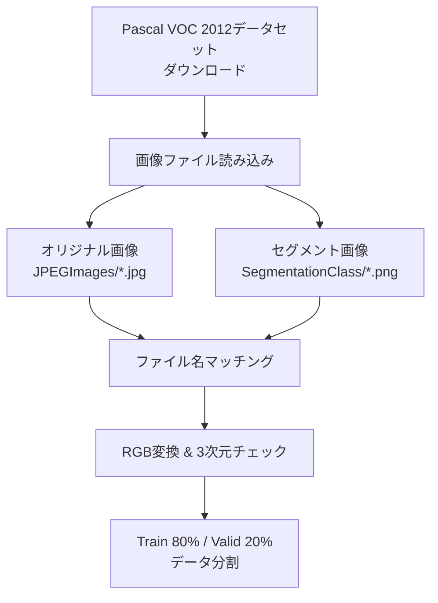
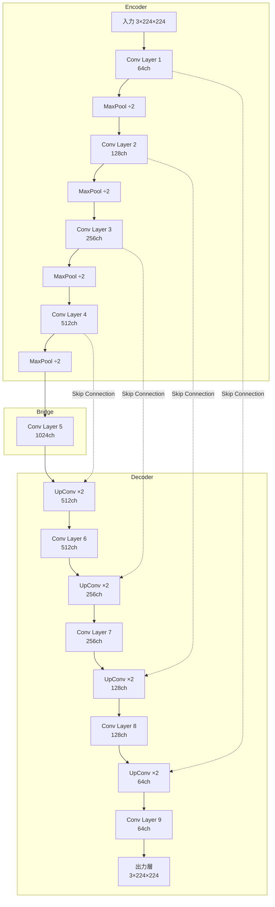
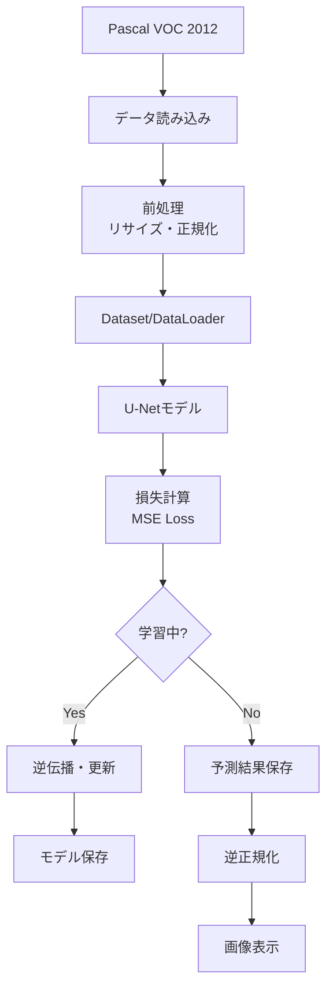

# このフォルダのプログラムについて

このフォルダのmainプログラム(main.ipynb)は、U-Netの勉強を兼ねて、Hugging Faceにアップロードされているセマンティックセグメンテーション用のデータをimage-to-imageの題材の代わりとして用いて、U-Netの実装やFine Tuningを試してみたものになります。 

# U-Netによるセマンティックセグメンテーション

Pascal VOC 2012データセットを用いた画像セグメンテーションの実装

## プログラム概要

- **目的**: U-Netモデルを用いた画像セグメンテーション
- **データセット**: Pascal VOC 2012 (validation set)
- **フレームワーク**: PyTorch
- **モデル**: カスタムU-Net実装
- **損失関数**: MSE Loss
- **最適化**: Adam optimizer (lr=0.001)

---

## データ準備フロー

---

## データ前処理

**データ拡張**
- リサイズ: 224×224ピクセルに統一

**正規化とテンソル化**
1. PIL画像 → NumPy配列
2. 軸の転置: (H, W, C) → (C, H, W)
3. 正規化: ピクセル値を0-1に変換 (÷255)
4. PyTorchテンソルに変換

**カスタムDatasetクラス**
- 入力画像とセグメント画像のペアを管理
- DataLoaderでバッチサイズ20で読み込み

---

## U-Netアーキテクチャ

---

## U-Net構成要素

**ConvBlock (畳み込みブロック)**
- Conv2d (3×3, padding=1)
- BatchNorm2d
- ReLU

**ConvLayer (畳み込み層)**
- 3つのConvBlockを連続適用
- チャンネル数を調整しながら特徴抽出

**UpConvBlock (アップサンプリングブロック)**
- ConvTranspose2d (解像度2倍、チャンネル半減)
- BatchNorm2d
- ReLU

---

## データフロー全体像

