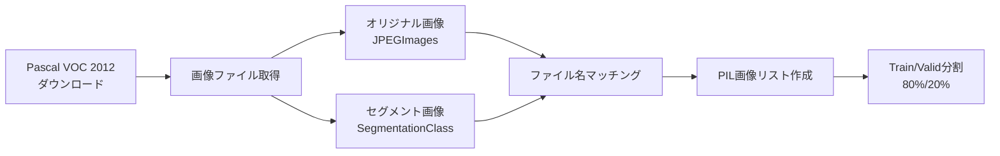
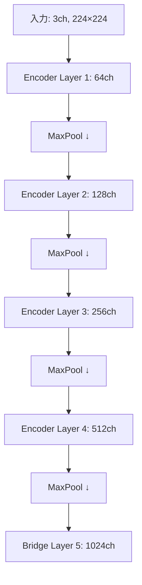
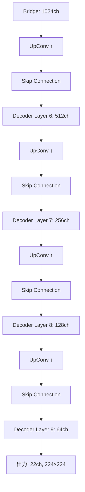
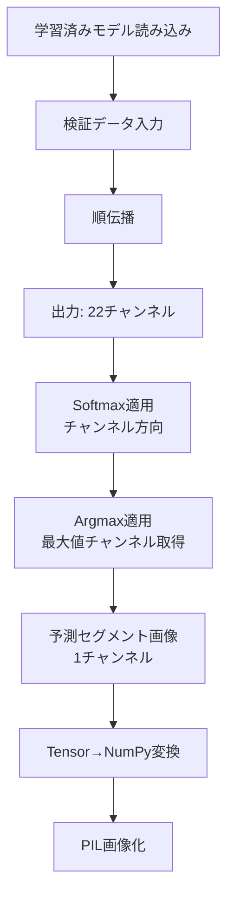

# このフォルダのプログラムについて

このフォルダのmainプログラム(main.ipynb)は、U-Netの勉強を兼ねて、Hugging Faceにアップロードされているセマンティックセグメンテーション用のデータを題材にして、U-Netの実装やFine Tuningを試してみたものになります。 

# U-Netによるセマンティックセグメンテーション

Pascal VOC 2012データセットを用いた画像セグメンテーションの実装

## プログラム概要

- 目的: U-Netモデルを使用した画像のセマンティックセグメンテーション
- データセット: Pascal VOC 2012 (validation set)
- フレームワーク: PyTorch
- モデル: カスタムU-Net実装
- クラス数: 22クラス (21クラス + 背景)

---

## データ準備フロー

---

## データ前処理

**画像変換処理**
- リサイズ: 224×224ピクセルに統一
- オリジナル画像: 
  - RGB値を255で除算して正規化 (0-1範囲)
  - FloatTensorに変換
- セグメント画像:
  - 値255を21に変換 (背景クラス)
  - LongTensorに変換 (クラスラベル)

---

## U-Netアーキテクチャ (1/3)

**基本ブロック構成**

MyUNetConvBlock: 畳み込みブロック
- Conv2d (3×3, padding=1)
- BatchNorm2d
- ReLU

MyUNetUpConvBlock: アップサンプリングブロック
- ConvTranspose2d (3×3, stride=2)
- BatchNorm2d
- ReLU

---

## U-Netアーキテクチャ (2/3)

---

## U-Netアーキテクチャ (3/3)

---

## モデル詳細

**ネットワーク構造**
- 入力次元: 3チャンネル (RGB)
- 隠れ層次元: 64 (基準値)
- 出力次元: 22チャンネル (クラス数)
- エンコーダ: 5層 (解像度を1/16に縮小)
- デコーダ: 4層 (解像度を元に戻す)
- Skip Connection: エンコーダとデコーダ間で特徴マップを結合

---

## 推論処理フロー

---

## まとめ

**実装内容**
1. Pascal VOC 2012データセットの取得と前処理
2. カスタムDataset/DataLoaderの実装
3. U-Netモデルの実装 (Encoder-Decoder + Skip Connection)
4. 学習・検証ループの実装
5. 損失値の可視化
6. 推論と結果の可視化
