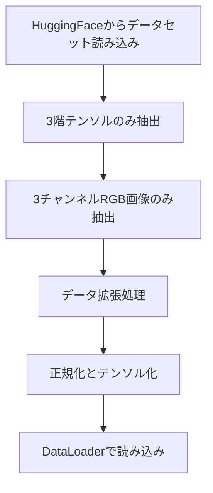
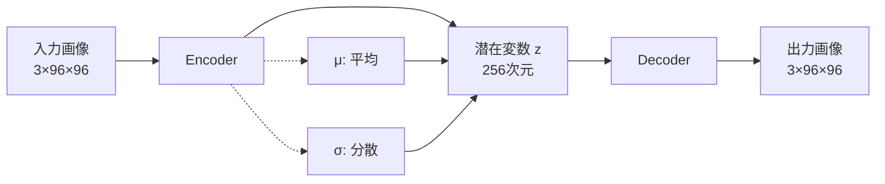
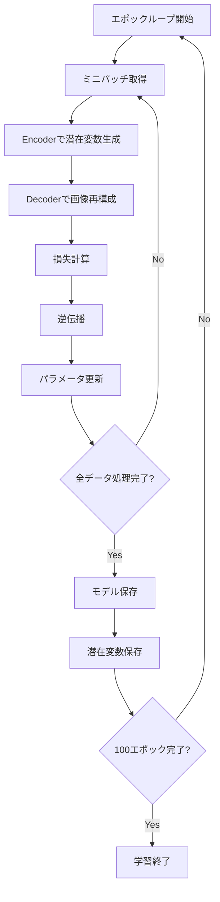
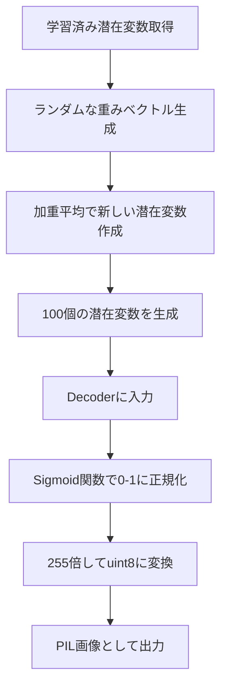

# このフォルダのプログラムについて

このフォルダのmainプログラム(main.ipynb)は、VAEの勉強を兼ねて、Hugging Faceにアップロードされているデータを画像生成の題材として用いて、VAEの実装やFine Tuningを試してみたものになります。<br>


# VAEによるアニメ顔画像生成

## プログラム概要

- **目的**: VAE (Variational Autoencoder) を用いたアニメ顔画像の生成
- **データセット**: HuggingFace の "Anime-Face-Dataset"
- **フレームワーク**: PyTorch
- **画像サイズ**: 96×96ピクセル (RGB 3チャンネル)

---

## データ前処理フロー



---

## データ拡張処理

実装されているデータ拡張:

1. リサイズ: 96×96ピクセルに統一
2. ランダム水平反転: 確率50%で左右反転
3. ランダム回転: -10度から+10度の範囲で回転

---

## VAEモデル構造



---

## Encoder構造

**5層の畳み込み層で段階的にダウンサンプリング**

| 層 | 入力チャンネル | 出力チャンネル | 解像度変化 |
|---|---|---|---|
| Layer 1 | 3 | 32 | 96×96 → 48×48 |
| Layer 2 | 32 | 64 | 48×48 → 24×24 |
| Layer 3 | 64 | 128 | 24×24 → 12×12 |
| Layer 4 | 128 | 256 | 12×12 → 6×6 |
| Layer 5 | 256 | 512 | 6×6 → 3×3 |

- 各層: Conv2d → BatchNorm → LeakyReLU
- 最終的に512×3×3 = 4608次元のベクトルに変換

---

## 潜在変数の生成

**再パラメータ化トリック (Reparameterization Trick)**

```python
mu = Linear(4608 → 256)           # 平均
sigma = Linear(4608 → 256)        # 分散
epsilon = randn_like(mu)          # 標準正規分布からサンプリング
z = mu + exp(sigma/2) * epsilon   # 潜在変数
```

- μ (平均) とσ (分散) を学習
- εを用いて確率的にサンプリング
- 勾配が逆伝播可能な形式

---

## Decoder構造

**5層の転置畳み込み層で段階的にアップサンプリング**

| 層 | 入力チャンネル | 出力チャンネル | 解像度変化 |
|---|---|---|---|
| Layer 1 | 256次元 | 512×3×3 | 全結合層 |
| Layer 2 | 512 | 256 | 3×3 → 6×6 |
| Layer 3 | 256 | 128 | 6×6 → 12×12 |
| Layer 4 | 128 | 64 | 12×12 → 24×24 |
| Layer 5 | 64 | 32 | 24×24 → 48×48 |
| Layer 6 | 32 | 3 | 48×48 → 96×96 |

---

## 損失関数

VAEの損失関数は2つの項から構成:

```python
loss_1 = BCEWithLogitsLoss(output, input)
loss_2 = -0.5 * sum(1 + sigma - mu^2 - exp(sigma))
loss = loss_1 + loss_2
```

1. 再構成誤差 (loss_1): 入力と出力の差 (Binary Cross Entropy)
2. 正則化項 (loss_2): KLダイバージェンス (潜在変数を正規分布に近づける)

---

## 学習プロセス



---

## 画像生成プロセス


