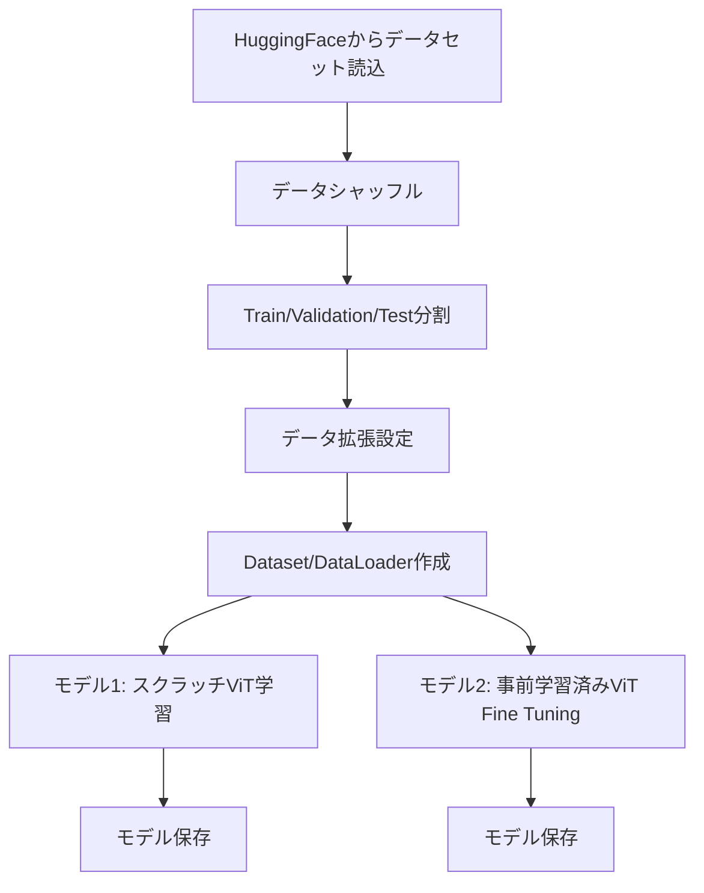

# このフォルダのプログラムについて

このフォルダのmainプログラム(main.ipynb)は、Vision Transformerの勉強を兼ねて、Hugging Faceにアップロードされている画像分類用のデータを使って、バニラViTや事前学習済みVitに対してFine Tuningや、Fine Tuning後での画像分類を試してみたものになります。<br>


# プログラム概要

このプログラムは以下の2つのアプローチで犬猫画像分類を行います:

1. **スクラッチからのVision Transformer学習**
   - vit_pytorchライブラリを使用したバニラViT実装
   
2. **事前学習済みモデルのFine Tuning**
   - timmライブラリの`vit_small_patch16_224`を使用

---

## 処理フロー全体像



---

## データセット準備

- **データソース**: HuggingFace `cats_vs_dogs` データセット
- **分割比率**:
  - Test: 10% (全体から)
  - Validation: 20% (残りから)
  - Train: 残り (約72%)
- **分割方法**: `stratify_by_column="labels"` でラベルが均等に分配


- **データ拡張 (Data Augmentation)**
  - `Resize(224, 224)`
  - `RandomResizedCrop(224, 224)` - ランダム切り抜き
  - `RandomHorizontalFlip(p=0.5)` - 左右反転
  - `ToTensor()` - テンソル変換

---

## モデル1: スクラッチViT構成

**アーキテクチャパラメータ**

| パラメータ | 値 | 説明 |
|----------|-----|------|
| dim | 128 | Embedding次元数 |
| image_size | 224 | 入力画像サイズ |
| patch_size | 7 | パッチサイズ (32×32パッチ) |
| num_classes | 2 | 出力クラス数 (犬/猫) |
| depth | 12 | Transformer層の深さ |
| heads | 8 | Multi-Head Attention数 |

---

## モデル2: 事前学習済みViT

**モデル仕様**

```python
nn_model = timm.create_model(
    model_name="vit_small_patch16_224",
    pretrained=True,
    num_classes=2
)
```

- ベースモデル: `vit_small_patch16_224`
- 事前学習: ImageNetで学習済み
- Fine Tuning: 出力層を2クラスに変更して再学習

---

## データフロー図


## まとめ

**プログラムの実施内容**

1. 犬猫画像データセットの準備と分割
2. データ拡張パイプラインの構築
3. カスタムDataset/DataLoaderの実装
4. スクラッチViTモデルの学習 (5エポック)
5. 事前学習済みViTモデルのFine Tuning (5エポック)
6. 各エポックでの学習・検証とモデル保存

---
